# WTFTD — War Thunder Full Test Drive

> **Beta** — it works, but some features are still untested in game (see *Known limits*). Feedback and bug
> reports are welcome in the issues.
>
> **Disclaimer** — I'm not a professional developer: WTFTD is a hobby project, built with the help of AI
> tools. The code is open and tested, but expect rough edges, and check it yourself if in doubt.

[](https://github.com/StonewarP/WTFTD-War_Thunder_Full_Test_Drive/releases)
[](https://github.com/StonewarP/WTFTD-War_Thunder_Full_Test_Drive/actions/workflows/tests.yml)
[](LICENSE)
[](https://ko-fi.com/stonewarp)

Test drive **any** War Thunder vehicle — ground, aircraft, helicopters, boats, ships — with the
loadout, ammunition, map, targets and conditions you choose, even vehicles you don't own.

WTFTD takes an **official Test Drive / Test Flight mission** from the game files (with its targets,
triggers and respawn logic), puts your vehicle and setup in it, and writes it to
`War Thunder/UserMissions/`. In game: **Single missions → User missions**.

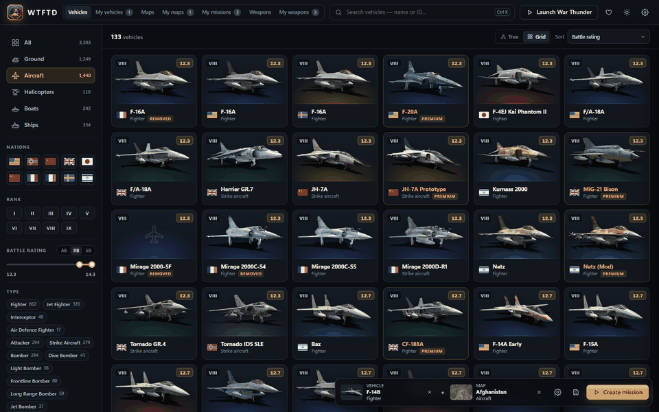

## Download

**[⬇ Download WTFTD.exe](https://github.com/StonewarP/WTFTD-War_Thunder_Full_Test_Drive/releases)** (Windows 10/11) or
**WTFTD-macOS.zip** (macOS, Apple silicon) — nothing to install: double-click it, the app opens in its own
window and finds your game by itself (Steam or standalone). Close the window to quit.

- **First launch**: WTFTD downloads the game data once (≈1 GB from the community
  [War Thunder datamine](https://github.com/gszabi99/War-Thunder-Datamine), 2–5 minutes) and builds its
  database on your PC. No game data is shipped with WTFTD. If Git isn't installed, the official portable
  MinGit (git-for-windows) is fetched automatically. The data then updates itself after each game patch.
- Your settings, missions and the game database live in `%LOCALAPPDATA%\WTFTD` (Windows) or
  `~/Library/Application Support/WTFTD` (macOS).
- The apps are not code-signed: if Windows SmartScreen warns you, click **More info → Run anyway**. On macOS,
  unzip `WTFTD-macOS.zip`, move `WTFTD.app` to *Applications*, open it once, then allow it in **System Settings →
  Privacy & Security → Open Anyway**. Both are built by GitHub Actions from the released source code, and each
  release lists their **SHA-256**: check your download with `Get-FileHash WTFTD.exe` in PowerShell or
  `shasum -a 256 WTFTD-macOS.zip` in Terminal.
- The app window uses Edge or Chrome (on macOS: Chrome, Edge, Brave or Chromium) in app mode; without one,
  WTFTD opens in your default browser.
- When a new version is released, the app tells you (a *New version* button at the top) — download the new version
  and replace the old one; your settings and missions are kept.

## How it works

1. **Pick a vehicle** in the list or in the research trees (filters by category, type — light / heavy tank,
   fighter, bomber… —, nation, rank, BR…).
2. **Set it up** step by step: map & scenario, loadout, ammunition, modifications, cheats, conditions.
3. **Create mission**, start War Thunder (button in the app), open *Single missions → User missions*.

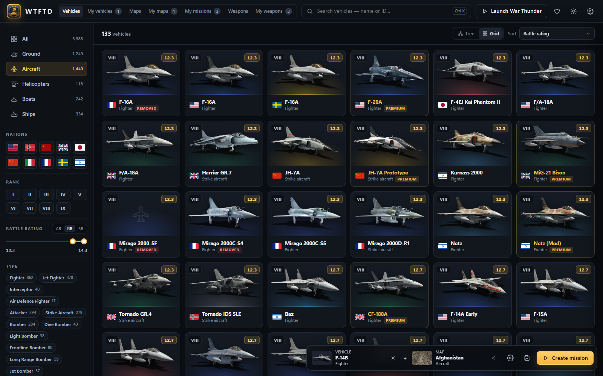

| Stats: tanks over 60 km/h, best turret armor first | Carrying the AIM-9L, fastest first, vehicle stats |
|---|---|
| 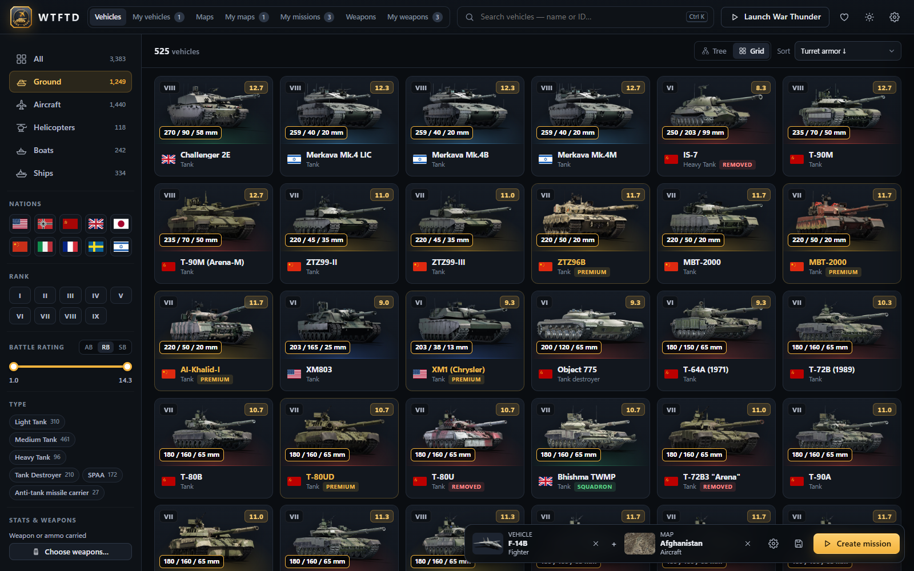 | 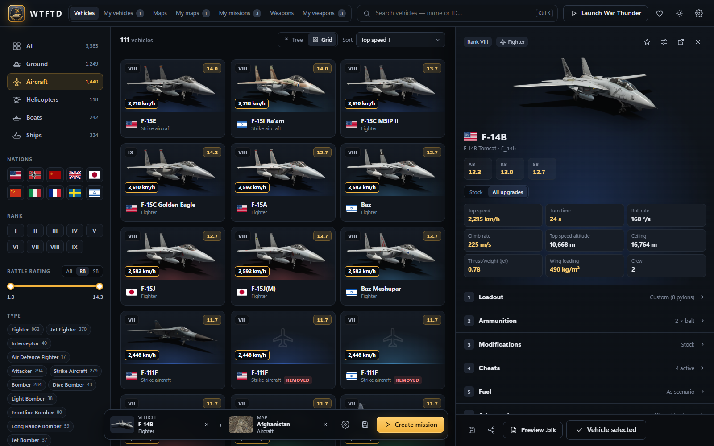 |

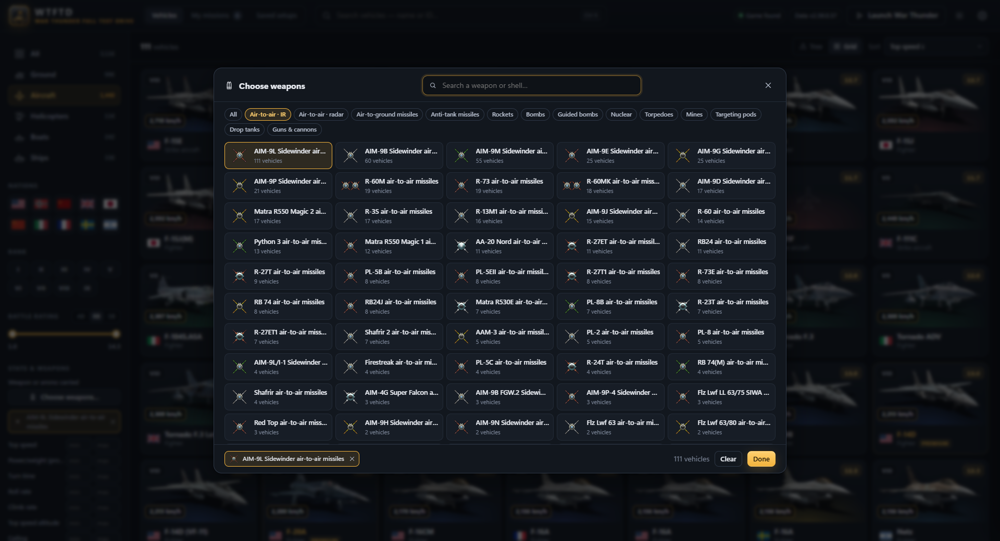

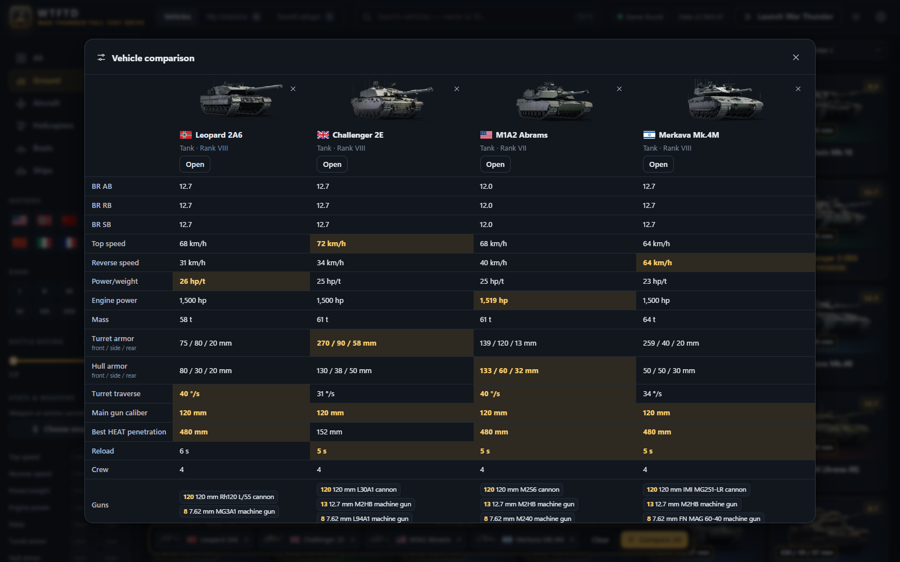

| Weapons page: IR missiles ranked for dogfight, R-73 details and community view | Comparing weapons side by side |
|---|---|
| 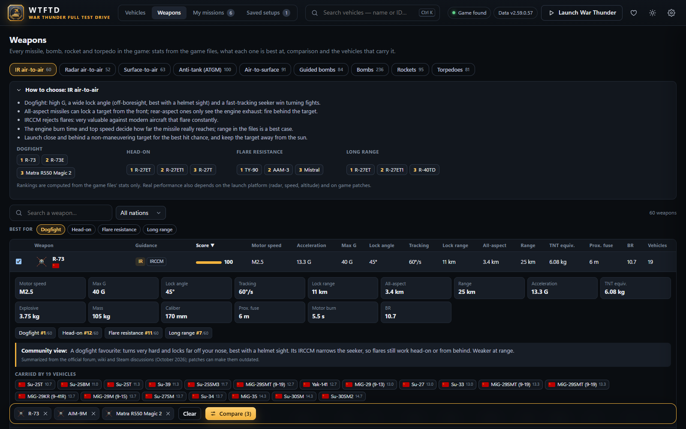 | 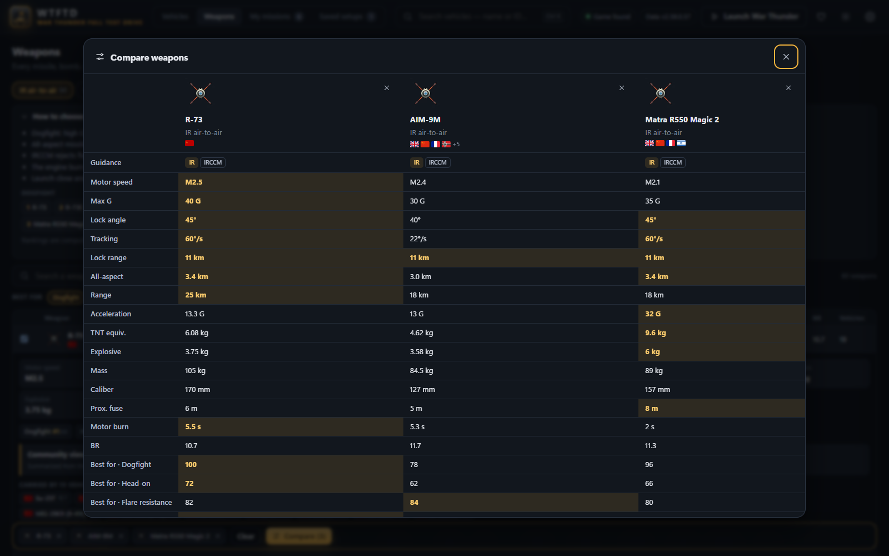 |

| Research trees | Pylon editor — here a B61 nuclear bomb on pylon 5 |
|---|---|
| 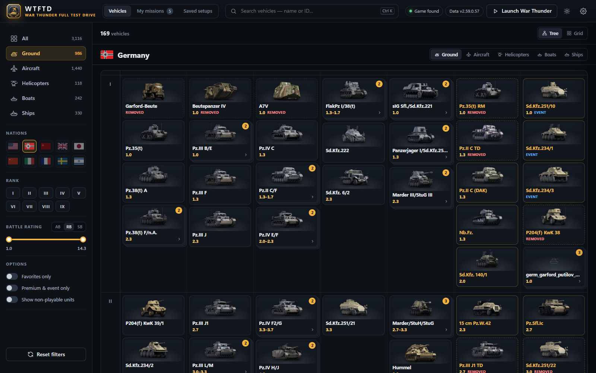 | 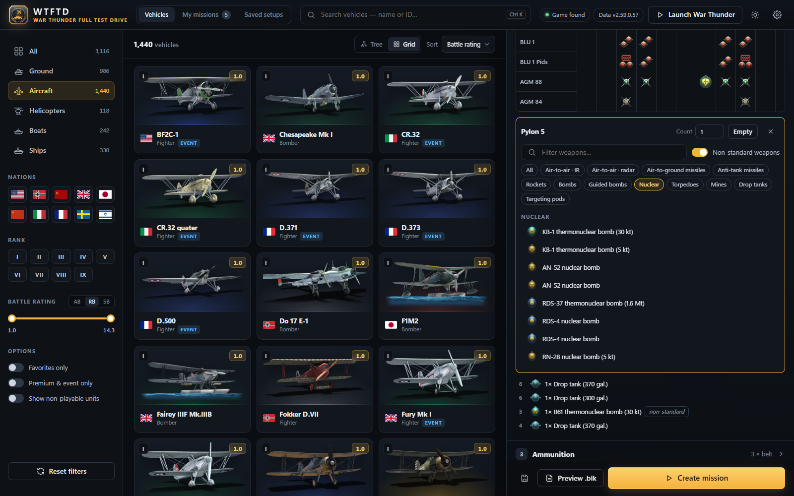 |

| Scenario editor on the real map, with ground heights | Your real spawn (runway) and targets at your BR |
|---|---|
| 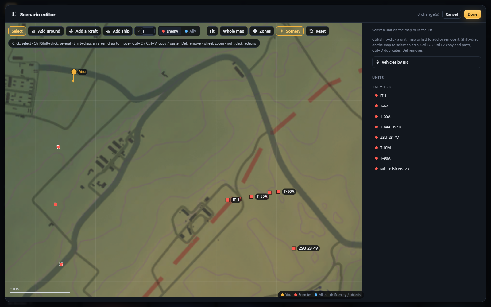 | 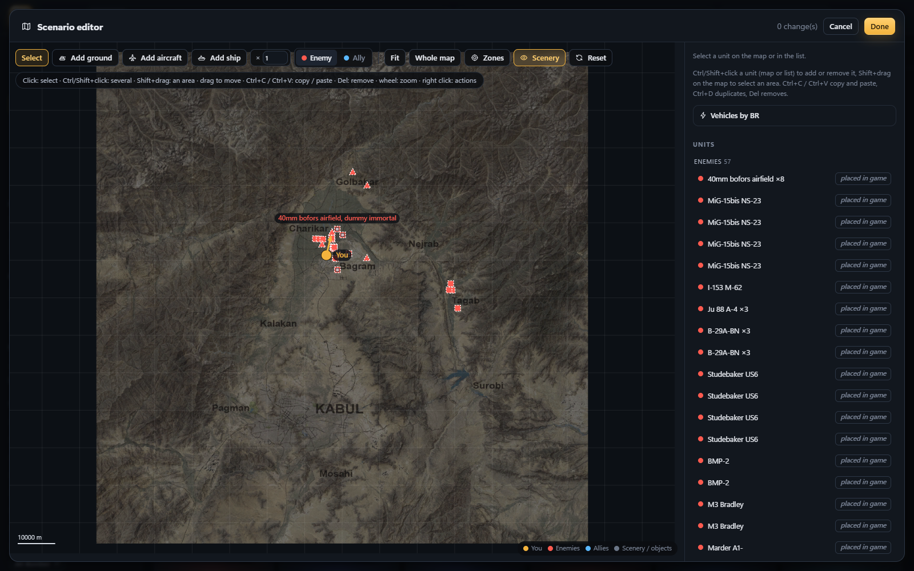 |

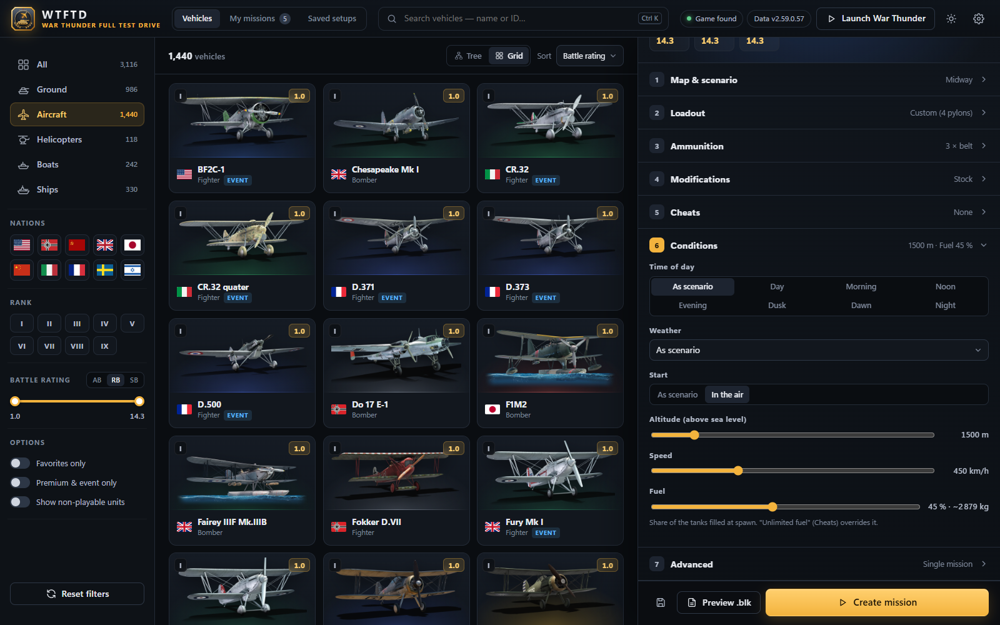

## Features

- **3,500+ vehicles** with images from the [War Thunder wiki](https://wiki.warthunder.com/), grid or
  research-tree view, filters (category, **vehicle type** — light / medium / heavy tank, tank destroyer, SPAA,
  fighter, bomber, attacker, helicopter, destroyer… with the game's own names —, nation, rank, BR in AB/RB/SB,
  favorites, premium/event, non-playable units), **sort by rarity** with badges (premium, squadron, pack, event,
  removed, hidden)
- **Stats & fine search**: each vehicle's performance — top / reverse speed, power-to-weight, engine power,
  turret / hull armor, turret traverse, gun caliber, HEAT penetration, reload; for aircraft turn time, roll rate,
  climb rate, ceiling, thrust-to-weight, wing loading; for ships displacement — shown on its card, with a
  **Stock / All upgrades** switch (stock values from the modules' penalties, estimated for aircraft), **sortable**
  (fastest, best turning, best armored…) and **filterable with min / max** values. **Weapon picker**: pick carried
  weapons by their game icon (missiles, bombs, rockets, nuclear, guns, shells — or a shell type like “any
  APFSDS”), with how many vehicles carry each; vehicles must carry all the picked weapons
- **Weapons page**: every missile, bomb, rocket and torpedo (~860) by category — IR / radar air-to-air,
  surface-to-air, ATGM, air-to-surface, guided bombs, bombs, **nuclear bombs** (yield from 5 kt to 1.6 Mt, and the
  ground battles' instant-win killstreak nukes), rockets, torpedoes — with stats from the game files
  (motor speed, max G, lock angle, IRCCM, seeker range, penetration, TNT equivalent…), **"best for" rankings**
  (dogfight, head-on, flare resistance, beyond visual range, killing tanks, stand-off…), a short guide per
  category, community notes on well-known weapons, side-by-side comparison and the vehicles that carry each one
- **Compare up to 5 vehicles side by side** (button next to the favorite star): BR, every stat with the best
  value highlighted, guns with their caliber, shell types, pylon weapons
- **100+ official scenarios**: firing range, Fulda, naval range, airfields, heli ranges, carriers,
  seaplane bases… plus the **hangar maps** (regular, winter, Halloween, Lunar New Year, anniversary)
- **Loadout**: every official preset, or a **pylon editor** laid out like the game's (presets as rows,
  pylons as columns, game icons). Turn on **non-standard weapons** to mount any of the game's ~2,300 air
  weapons on any pylon — missiles, bombs, rockets, torpedoes, pods, and **nuclear bombs** (RN-28, RN-40,
  B61, AN-52, KB-1, RDS-4, RDS-37) — with a warning when the aircraft lacks the radar / laser designator /
  guidance the weapon needs
- **Ammunition**: 4 shell slots with round counts for tanks; belts per gun for aircraft, helicopters and ships; the
  game's own shell and belt icons; **flares / chaff split** for countermeasure launchers (beta, see *Known limits*)
- **Modifications** (custom vehicles): engine power, mass, top speed, brakes, turret speed, thrust,
  reload, ammo capacity, shell velocity / mass / explosive / penetration…
- **Scenario editor** on the level's real tactical map, read from the game files:
  - drag any unit (and your start) to move it — ground units are put **on the ground** using the map's heightmap;
  - add ground, air or naval units as **allies or enemies**, remove units, swap their vehicle;
  - the units of the game's templates (test flight targets) can change vehicle too;
  - **vehicles by BR**: enemies, allies or a selection get vehicles of their own kind at your vehicle's BR (they
    follow it when you take another one) or at a BR you pick, from the nations you choose;
  - behaviour: still, aggressive, return fire or passive; enemies can **hunt you**, allies can **escort you**;
  - shows where the scenario really spawns you (runway / start area) and the units it teleports
- **Conditions**: time of day, weather, air start with altitude / speed, **fuel load** (% of the tanks)
- **Cheats**: invulnerable, unlimited ammo, no reload, unlimited fuel, auto repair / rearm, passive
  targets, no collisions, expert / ace crew
- **11 languages**: English, Français, Deutsch, Русский, Polski, Español, Português, Italiano, Čeština,
  简体中文, 日本語 — picked from your Windows language on first launch (or on the welcome screen), vehicle,
  weapon and map names follow the game's own translations. UI translations
  other than English were machine-assisted and may contain mistakes: corrections are welcome
- **Uninstall** from Settings: everything, or only some parts (custom vehicle files in the game, missions,
  cache, game database, your settings and library, the app itself); War Thunder itself is never touched
- **Share a setup** with a friend: a short code to paste, or a `.wtftd` file — they import it (Saved setups →
  Import, or drop the file on the window) and get the same mission: vehicle, loadout, ammo, map, editor
  changes, cheats. User missions are single-player, so each of you plays it on your own PC
- Dark / light theme, saved setups, list of generated missions, `.blk` preview, launch War Thunder

## Custom vehicles (on by default)

War Thunder only opens a user mission if you own its vehicle. With **custom vehicles** (Settings),
WTFTD uses the game's `userVehicles` mechanism (from the CDK, popularised by Ask3lad):

- the mission uses `unit_class:t="userVehicles/<host>"`, where `<host>` is a vehicle you own (US reserve
  vehicles by default: M2A4, PT-6, USS Litchfield — helicopters have no reserve, pick one you own).
  Aircraft get their own new file in `content/pkg_user` and need no host;
- WTFTD writes files that `include` the real vehicle and apply your **modifications** and
  **pylon-by-pylon loadouts** with `@override:` lines.

Rules: only new files are written (never a path that replaces a game file), every file is listed in
`user/cdk_manifest.json`, and **Settings → Remove custom vehicle files** deletes them (do it before
playing online if you want a clean install). One custom vehicle per type at a time: the last mission you
create defines it. This is not endorsed by Gaijin — use at your own risk.

## Map backgrounds & ground heights

The editor draws the level's tactical maps (full map + detailed ground-battle map) straight from the
game's texture packs (`content/base/res/*.dxp.bin`). They are Oodle-compressed: WTFTD uses the official
Oodle runtime (`oo2core_<n>_win64.dll` on Windows, `liboo2core*.dylib` on macOS, version 6+) that many other
games ship (Battlefield, Call of Duty, Cyberpunk…) — it is found automatically in your Steam / Epic / game
folders, or set it in **Settings**. On macOS few games ship one, so map backgrounds usually come from the
capture described below.
Ground heights come the same way from the level's heightmap (`levels/<map>.bin`, ground-battle maps);
older air maps have no heightmap and heights are estimated there. Without Oodle, a scenario's map is
captured from the game (localhost:8111) the first time you play it with WTFTD open.

## FAQ

**Can I get banned for this?**
User missions are a normal feature of the game (*Single missions → User missions*), and WTFTD only uses
the game's own files and mechanisms. Custom vehicles add files to the game's `content` folder (the CDK
`userVehicles` mechanism modders use) — never replacing a game file, and only used by your offline missions.
There are no known bans for it, but it isn't endorsed by Gaijin: use it at your own risk, and remove the
custom vehicle files (**Settings → Remove custom vehicle files**) before playing online if you want a clean install.

**Can I play my mission online or with friends?**
No: user missions are single-player. Send your friends the setup instead (**Share** → a code or a `.wtftd`
file); they import it and play the same mission on their PC.

**Why does Windows / macOS / my antivirus warn me about the app?**
The exe isn't code-signed yet, so SmartScreen shows *Windows protected your PC* (**More info → Run anyway**).
Apps packaged with PyInstaller are also sometimes flagged by mistake by antivirus software. The exe is built
by GitHub Actions from the public source code and its SHA-256 is listed in each release; you can also
[run WTFTD from source](#run-from-source). On macOS, Gatekeeper blocks unsigned apps the first time: open
**System Settings → Privacy & Security** and click **Open Anyway** next to WTFTD.

**Do I need to own the vehicle?**
No, with custom vehicles on (default). Without them, the game only opens user missions with vehicles you own.

**The game was updated, did WTFTD break?**
The game data rebuilds itself after each patch (checked every 3 hours and at start-up), or by hand with
**Settings → Update game data**. If a mission stops working, [report it](https://github.com/StonewarP/WTFTD-War_Thunder_Full_Test_Drive/issues/new/choose)
with your setup's share code.

**Where are my files? How do I uninstall?**
Settings, setups and the game database: `%LOCALAPPDATA%\WTFTD` (Windows) or `~/Library/Application Support/WTFTD`
(macOS). Missions: `UserMissions` in the game folder (on macOS inside
`WarThunderLauncher.app/Contents/WarThunder.app/Contents/Resources/game`; **Open folder** in the app shows it).
To uninstall: **Settings → Remove custom vehicle files**, then delete the app and its data folder.

**Does WTFTD collect anything?**
No: no account, no telemetry. It downloads the datamine, wiki images and this repository's release list,
and sends nothing. See [SECURITY.md](SECURITY.md).

## Run from source

Needs Python 3.10+ (no extra packages). Double-click **`start.bat`** (Windows) or **`start.command`** (macOS), or:

```bash
python -m wtftd
```

`python -m wtftd --browser` uses your default browser instead of an app window.

To build `dist\WTFTD.exe` yourself, run **`build_exe.bat`** on Windows; for `dist/WTFTD.app` (and
`dist/WTFTD-macOS.zip`), run **`./build_app.sh`** on a Mac. Both install PyInstaller in `.cache/build-venv`.

## Game data & automatic updates

The game database (`data/`, not in this repository) is generated on your PC from the community datamine
([gszabi99/War-Thunder-Datamine](https://github.com/gszabi99/War-Thunder-Datamine)): first download ≈1 GB
into `.cache/datamine`, with your Git or an automatically fetched MinGit (Windows). On macOS, WTFTD uses
Homebrew's Git or Apple's, and offers to install Apple's Command Line Tools if there is none. Every 3 hours (and at start-up)
WTFTD checks the datamine's game version and rebuilds after a patch. Manual update: **Settings → Update
game data**, or `python -m wtftd.builder`.

## Translations

UI text lives in `web/locales/<code>.json`. The non-English files were machine-assisted: native speakers'
corrections are very welcome — see [CONTRIBUTING.md](CONTRIBUTING.md#translations).

## Known limits

- Stats come from the game's own stat cards (aircraft, armor) or are computed from the vehicle files (tank top
  speed from the gearbox, ±10 %). Kinetic (AP / APFSDS) penetration isn't stored in the game files and isn't shown.
- Without custom vehicles, aircraft use the official presets and the vehicle must be owned.
- For aircraft and ships, belts are matched to gun groups in order (best effort).
- A few scenarios pick their spawn / enemies from your vehicle's nation (Mozdok heli / UCAV, Denmark
  hydrobase); the editor shows their default branch.
- Missions and custom vehicles are local: they can't be played together online (custom battles / co-op use
  Gaijin's servers and the official vehicle files). Share the setup instead.
- "Non-playable units" come from the game files (AI, removed, unreleased) and may not load or behave oddly.
- The flares / chaff split is new and not yet checked in game ([checklist](docs/ingame-checklist.md)).
- macOS support is new and less tested than Windows. The packaged app is built for Apple silicon; on an Intel
  Mac, [run from source](#run-from-source).

## Layout

```
start.bat / build_exe.bat   run from source / build WTFTD.exe (Windows)
start.command / build_app.sh run from source / build WTFTD.app (macOS)
wtftd_app.py                entry point of the packaged app
wtftd/                      Python backend (stdlib only)
  server.py                 local HTTP server + API (127.0.0.1 only)
  mission.py                official scenario + your setup -> .blk mission
  cdk.py                    custom vehicle files (userVehicles + @override modifications)
  maptex.py / terrain.py    tactical maps and heightmaps from the game files
  builder.py                datamine -> data/*.json
  armament.py               Weapons page data (missiles, bombs, rockets, torpedoes)
  blk.py, game.py, paths.py BLK writer, install detection, file locations
web/                        UI (HTML/CSS/JS, no build step), web/locales = translations, stats.js = stats & search
data/                       game database, generated on first launch (not versioned)
tests/                      automated tests (python -m unittest discover -s tests -t .)
docs/screenshots/           README images
docs/ingame-checklist.md    what still needs checking in game
```

## Feedback

Found a bug or have an idea? **Settings → Report a bug / Suggest an idea**, or open an
[issue](https://github.com/StonewarP/WTFTD-War_Thunder_Full_Test_Drive/issues/new/choose). For bugs, paste your setup's **share code** — it lets
us rebuild your exact setup. Questions: [Discussions](https://github.com/StonewarP/WTFTD-War_Thunder_Full_Test_Drive/discussions).

Want to help (code, translations)? See [CONTRIBUTING.md](CONTRIBUTING.md). What changed in each version:
[CHANGELOG.md](CHANGELOG.md). Security problem: [SECURITY.md](SECURITY.md).

## Support

WTFTD is free and always will be. If you enjoy it, you can support its development on
**[Ko-fi](https://ko-fi.com/stonewarp)** ❤ (also the heart button in the app).

## License

[MIT](LICENSE) — free to use, modify and share, keeping the copyright notice. War Thunder and its data belong
to Gaijin Entertainment; WTFTD is a fan-made tool, not affiliated with or endorsed by Gaijin.
